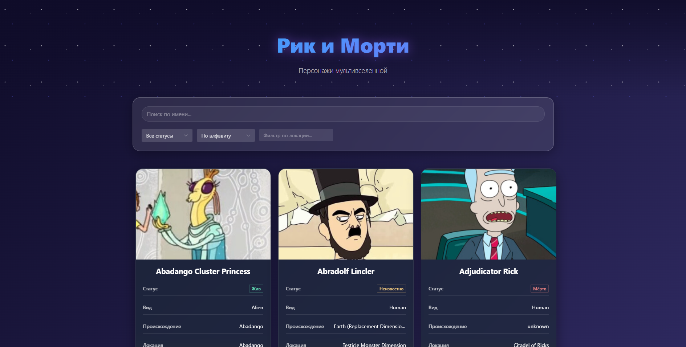

# Рик и Морти - Персонажи мультивселенной

## Описание

Vue 3 приложение для просмотра персонажей вселенной "Рик и Морти" с фильтрацией и сортировкой.

## Технологии

- Vue 3 + TypeScript
- Pinia (стейт-менеджмент)
- Naive UI (компоненты)
- Rick and Morty API

## Функциональность

- Поиск по имени персонажа
- Фильтрация по статусу (жив/мертв/неизвестно)
- Сортировка по имени и количеству эпизодов
- Фильтр по локации

## 📸 Скриншоты

### Главный экран

### Фильтрация персонажей

### Сортировка по эпизодам

